# Comeback

Digitalna platforma za rekreativni fudbal.

> Detaljno uputstvo za pokretanje i testiranje (portovi, ručni scenariji,
> automatski testovi) nalazi se u **[`docs/POKRETANJE-I-TESTIRANJE.md`](docs/POKRETANJE-I-TESTIRANJE.md)**.

## Preduslovi

- [Docker Desktop](https://www.docker.com/products/docker-desktop/) (pokrenut)
- [.NET 8 SDK](https://dotnet.microsoft.com/download/dotnet/8) — za testove
- [Node.js 20+](https://nodejs.org/) i npm

---

## Pokretanje

### 1. Backend (Docker)

```bash
cd infra/docker
docker compose up -d --build
```

Ovim se pokreću sve zavisnosti i servisi. **Migracije baza se izvršavaju automatski**
pri startu svakog servisa — ne pokreću se ručno. Takođe se **automatski kreira
admin nalog** (`admin@comeback.com` / `Test!234`).

| Servis / alat | URL |
|---|---|
| **Frontend** (pokreće se zasebno — korak 3) | http://localhost:4200 |
| **API Gateway** | http://localhost:5000 |
| Auth API | http://localhost:5104 |
| Profile API | http://localhost:5210 |
| Rating API | http://localhost:5310 |
| Notification API | http://localhost:5410 |
| Social API | http://localhost:5420 |
| Match API | http://localhost:5510 |
| Chat API | http://localhost:5610 |
| RabbitMQ Management | http://localhost:15672 |
| MailDev (inbox) | http://localhost:1080 |
| Seq (logovi) | http://localhost:5342 |

> Kredencijali RabbitMQ / baze: `comeback` / `comeback_dev`

### 2. Cloudinary (skladištenje medija) — opciono

**Svi mediji (slike/video) se čuvaju na Cloudinary-ju** — frontend šalje fajl
direktno, uz potpis sa backenda; u bazi ostaje samo URL.

**Aplikacija radi i bez Cloudinary-ja** — pokreće se normalno i sve funkcioniše
osim otpremanja medija. Funkcije koje zahtevaju Cloudinary nalog za testiranje:

- **Slika profila (avatar)** — Profil → *Izmeni profil*
- **Slika grupe** — Grupe → *Napravi / Izmeni grupu*
- **Galerija meča** — Meč → *Mediji* (slike/video)

Za uključivanje otpremanja medija potrebno je napraviti besplatan Cloudinary
nalog i popuniti kredencijale:

```bash
cd infra/docker
cp .env.example .env
# u .env se popunjavaju CLOUDINARY_CLOUD_NAME / API_KEY / API_SECRET
docker compose up -d profile-api match-api
```

> **Detaljno uputstvo** (pravljenje naloga, gde se navedeni podaci nalaze i gde
> se upisuju) je u [`docs/POKRETANJE-I-TESTIRANJE.md`](docs/POKRETANJE-I-TESTIRANJE.md),
> sekcija **2b**.
>
> Za demo/evaluaciju najlakše je koristiti jedan namenski privremeni besplatan
> nalog i podeliti njegove kredencijale uz projekat. Ako je repozitorijum
> javan, tajna se ne unosi u kod, već se prosleđuje uz `.env`.

### 3. Frontend

```bash
cd web/comeback-web
npm install
npm start
```

Aplikacija se otvara na **http://localhost:4200**.

### 4. Demo podaci (opciono)

Kada je sistem pokrenut, pomoćni alat popunjava aplikaciju demo podacima
(16 korisnika, grupe, odigrani mečevi sa rezultatima, feed sa lajkovima i
komentarima):

```bash
dotnet run --project tools/Comeback.DemoSeeder
```

Prvo pokretanje traje ~5 minuta (registracije prolaze kroz stvarnu verifikaciju
mejla preko MailDev-a); ponovno pokretanje je bezbedno i traje ispod minuta.
Demo prijava:
`marko.petrovic@demo.comeback.com` / `Test!234`. Detalji u
[`docs/POKRETANJE-I-TESTIRANJE.md`](docs/POKRETANJE-I-TESTIRANJE.md), sekcija 5.

---

## Testovi

```bash
dotnet test
```

Integracioni testovi koriste Testcontainers, pa Docker mora biti pokrenut.

---

## Dokumentacija koda

Backend je dokumentovan Doxygen komentarima. Generisanje (zahteva `doxygen` i
`python` na PATH-u):

```bash
doxygen Doxyfile
```

Generisana dokumentacija se zatim otvara iz `docs/api/html/index.html`. Detalji su u
[`docs/POKRETANJE-I-TESTIRANJE.md`](docs/POKRETANJE-I-TESTIRANJE.md), sekcija **8**.

---

## Arhitektura sistema

Sistem je organizovan kao skup mikroservisa (.NET 8) iza API Gateway-a, sa
Angular aplikacijom kao jedinim klijentom. Dijagrami u nastavku su u Mermaid
formatu i GitHub ih prikazuje automatski.

### Komponentni dijagram

Svaki mikroservis ima sopstvenu PostgreSQL bazu na koju se direktno vezuje
(*database-per-service*; baze se ne dele). Servisi komuniciraju sinhrono (HTTP,
pune strelice) i asinhrono preko RabbitMQ integracionih događaja (isprekidane
strelice, MassTransit + transakcioni outbox). Sve serverske komponente se
pokreću kroz Docker Compose (`infra/docker`).

Mediji se otpremaju iz browsera direktno na Cloudinary, ali tek nakon što
nadležni servis (Profile ili Match) izda kriptografski potpis za otpremanje —
u bazi se čuva samo URL medija.

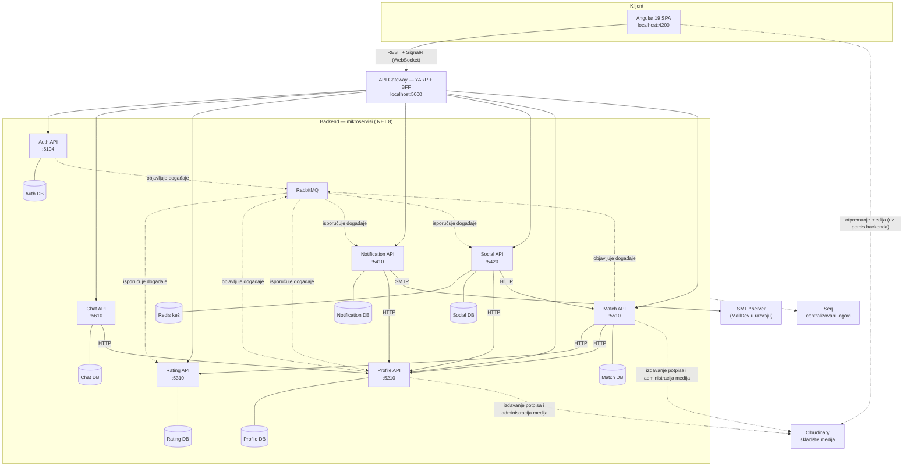

### Dijagram paketa servisa

Svaki mikroservis se sastoji od četiri projekta (paketa) organizovana po
principima Clean Architecture: `Comeback.<Servis>.Api`, `.Application`,
`.Domain` i `.Infrastructure`, uz zajednički paket `Comeback.BuildingBlocks`.
Strelica na dijagramu označava zavisnost („zavisi od"). Jedini izuzetak je
Notification servis, koji nema poseban Domain projekat.

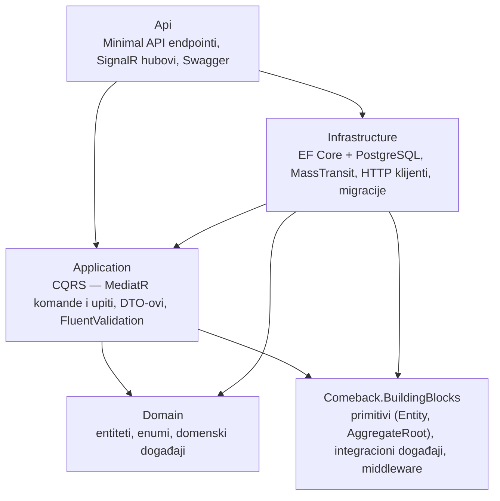

### Model podataka (klasni dijagrami po servisu)

Model podataka je prikazan klasnim dijagramima, po jedan za svaki servis.
Kompozicija (linija sa rombom) označava agregat čiji delovi nastaju i nestaju
sa celinom, obična asocijacija vezu ostvarenu fizičkim stranim ključem, a
isprekidana linija logičku vezu bez fizičkog stranog ključa. Svaki servis je
zaseban bounded context sa sopstvenom bazom, pa između servisa **ne postoje
fizički strani ključevi** — među-servisne veze su logičke, preko
identifikatora (`UserId`, `MatchId`, `GroupId`). Sufiks `?` u tipu polja
označava opciono polje. Detalji o ključevima i ograničenjima jedinstvenosti
navedeni su u tekstu uz svaki dijagram; tipovi poput `MatchStatus` su
enumeracije definisane u Domain sloju. Radi čitljivosti prikazana su ključna
polja, ne sva.

#### Auth

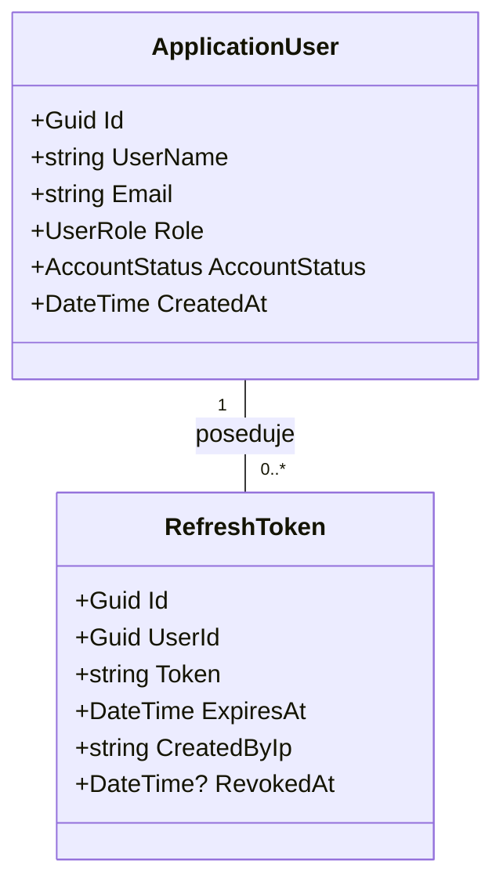

Polje `RefreshToken.UserId` je strani ključ ka `ApplicationUser`, a vrednost
`Token` je jedinstvena. Enumeracije: `UserRole` (Player, Organizer, Admin);
`AccountStatus` (PendingEmailVerification, Active, Suspended, Deactivated).

#### Profile

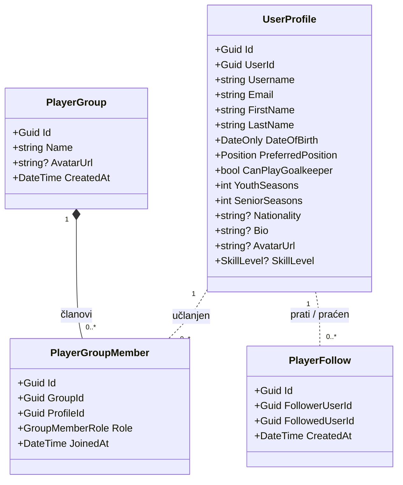

Polje `UserProfile.UserId` je jedinstveno i predstavlja logičku vezu ka nalogu
u Auth servisu. Kombinacija (`GroupId`, `ProfileId`) člana grupe je
jedinstvena, kao i kombinacija (`FollowerUserId`, `FollowedUserId`) praćenja.
Enumeracije: `Position` (Goalkeeper, Defender, Midfielder, Forward);
`SkillLevel` (Beginner, Intermediate, Advanced, Professional);
`GroupMemberRole` (Member, Captain).

#### Match

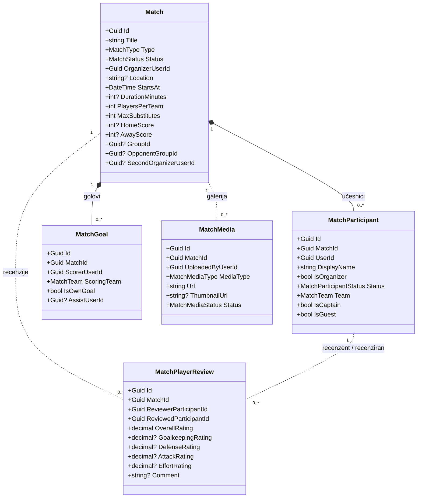

Učesnici i golovi su deo agregata meča i vezani su fizičkim stranim ključem;
recenzije i mediji referenciraju meč logički. Kombinacija (`MatchId`, `UserId`)
učesnika je jedinstvena, kao i trojka (`MatchId`, `ReviewerParticipantId`,
`ReviewedParticipantId`) recenzije. Enumeracije: `MatchType` (Independent,
GroupMatch, GroupVsGroup); `MatchStatus` (Scheduled, ResultOverdue,
ResultSubmitted, ResultConfirmed, Missed, Cancelled);
`MatchParticipantStatus` (Invited, Accepted, Declined, Withdrawn, Removed);
`MatchTeam` (None, Home, Away); `MatchMediaType` (Image, Video);
`MatchMediaStatus` (Uploaded, Processing, Active, Hidden, Removed, Rejected).

#### Chat

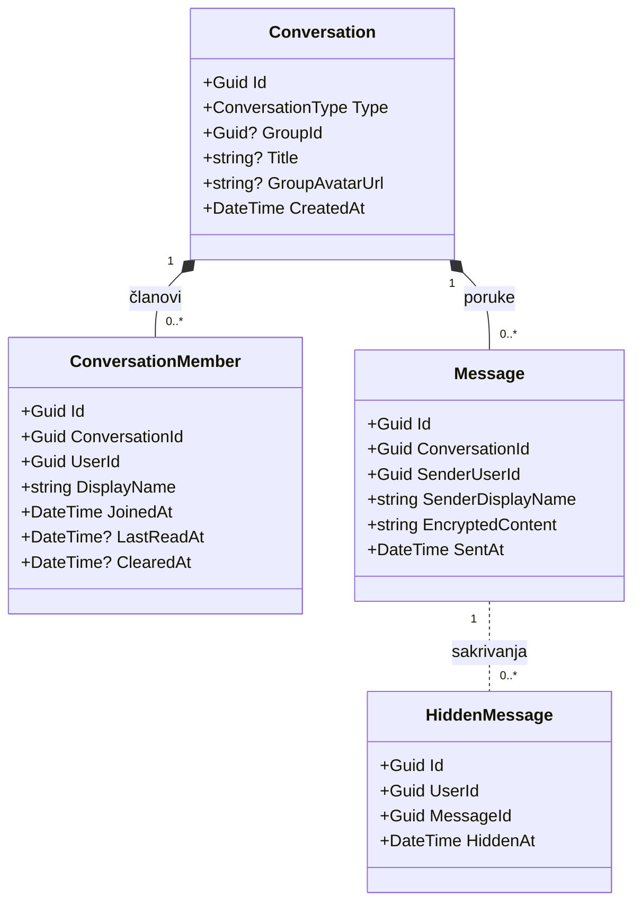

Polje `Conversation.GroupId` je logička veza ka grupi u Profile servisu i
jedinstveno je kada postoji. Kombinacija (`ConversationId`, `UserId`) člana je
jedinstvena, kao i kombinacija (`UserId`, `MessageId`) sakrivene poruke.
Sadržaj poruka se čuva šifrovan (AES). Enumeracije: `ConversationType`
(Direct, Group).

#### Rating

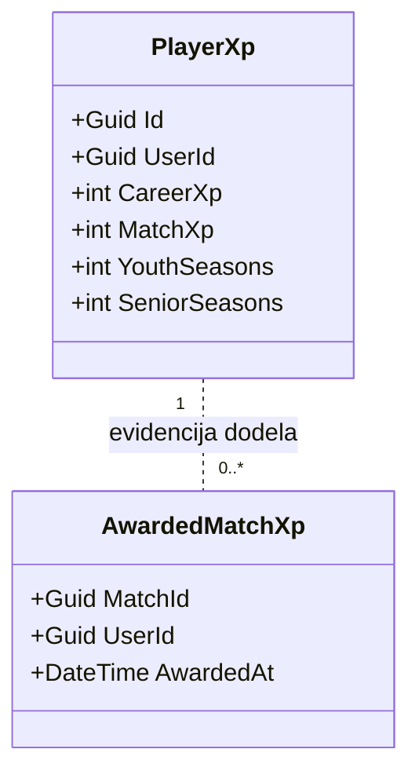

Polje `PlayerXp.UserId` je jedinstveno. Entitet `AwardedMatchXp` ima kompozitni
primarni ključ (`MatchId`, `UserId`), čime se obezbeđuje da se XP za isti meč
i istog igrača dodeli najviše jednom. Polja `TotalXp` i `Level` su izvedena
(računaju se iz `CareerXp` i `MatchXp`), pa se ne čuvaju u bazi.

#### Social

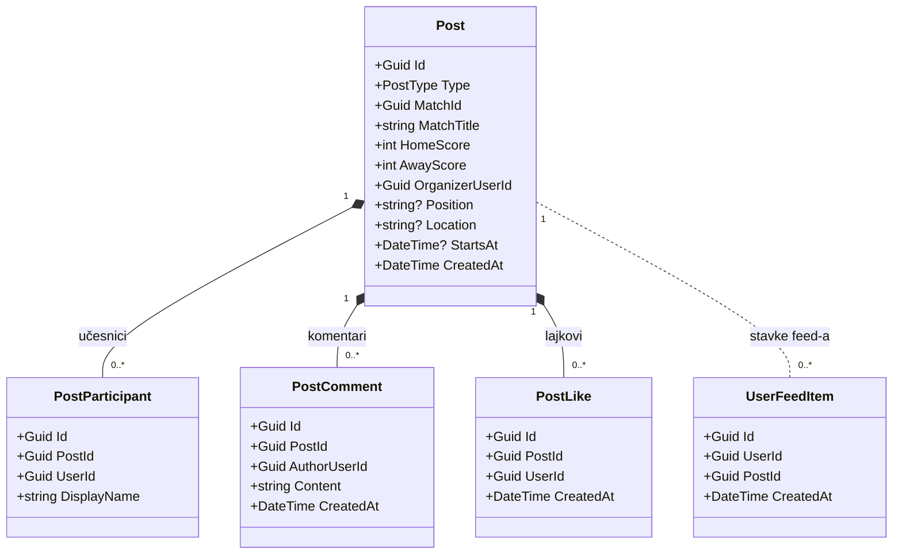

Polje `Post.MatchId` je logička veza ka meču u Match servisu; kombinacija
(`MatchId`, `Type`) je jedinstvena. Jedinstvene su i kombinacije (`PostId`,
`UserId`) lajka i (`UserId`, `PostId`) stavke feed-a. Entitet `UserFeedItem`
je denormalizovani model čitanja (*fan-out* feed-a po korisniku). Enumeracije:
`PostType` (MatchResult, PlayerWanted).

#### Notification

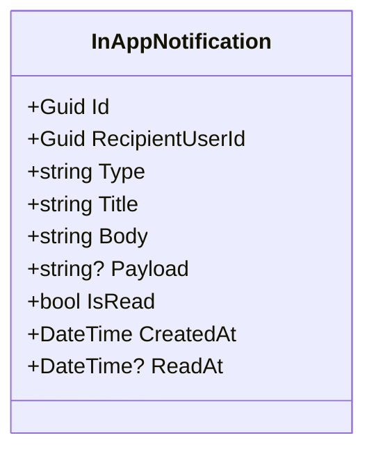

Polje `RecipientUserId` je logička veza ka korisniku, a `Payload` sadrži
dodatne podatke notifikacije u JSON formatu.

### Ključni tokovi (sekvencijalni dijagrami)

#### Registracija i verifikacija emaila

Pune strelice su sinhroni pozivi, a isprekidane povratne poruke — odgovor se
uvek vraća istim lancem kojim je zahtev stigao. Pošto se događaji objavljuju
asinhrono (transakcioni outbox), od trenutka kada Auth servis završi obradu
tok se deli na dve paralelne grane (`par` fragment): vraćanje odgovora
korisniku i obradu objavljenog događaja.

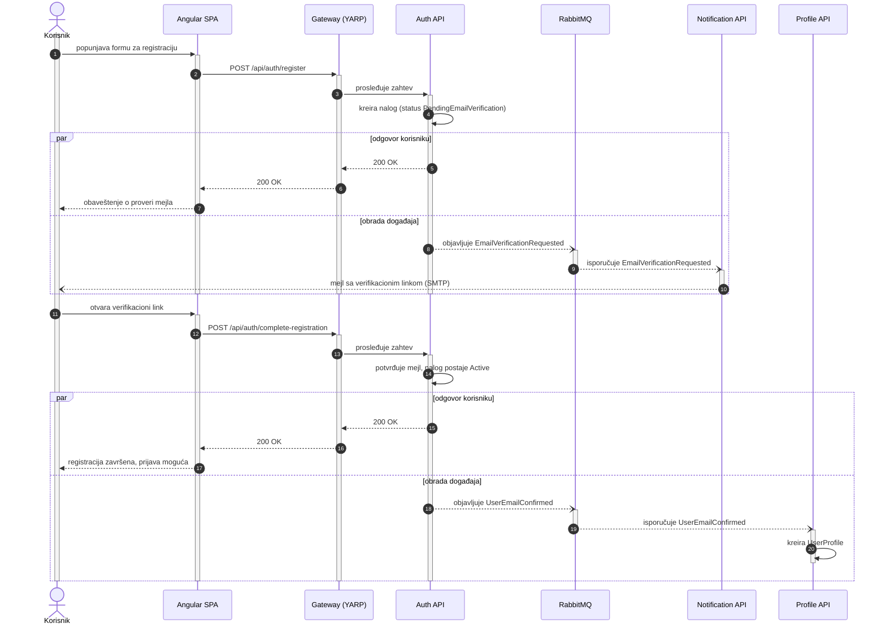

#### Unos rezultata meča

Nakon upisa rezultata tok se deli na dve paralelne grane: vraćanje odgovora
korisniku i obradu objavljenog događaja `MatchResultSubmitted`, koji RabbitMQ
isporučuje trima pretplaćenim servisima — svaki od njih ga obrađuje nezavisno
(ugnežđeni `par` fragment).

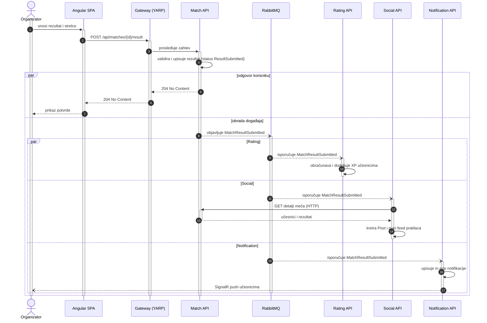

---

## Struktura projekta

```
src/
  building-blocks/    # Deljeni kod (integracioni događaji, izuzeci, middleware, Cloudinary)
  gateway/            # API Gateway + BFF (YARP, port 5000)
  services/
    auth/             # Autentifikacija i nalozi
    profile/          # Profili igrača, nacionalnosti, pratioci
    rating/           # XP i ELO rejting
    match/            # Mečevi i javni pozivi ("tražim igrača")
    chat/             # Grupni chat (SignalR)
    notification/     # Email + žive notifikacije (SignalR)
    social/           # Feed i objave (+ Redis keš)

web/
  comeback-web/       # Angular 19 aplikacija

infra/
  docker/             # docker-compose.yml (+ .env.example)

tools/
  Comeback.DemoSeeder/  # Alat za punjenje aplikacije demo podacima

docs/                 # Uputstvo za pokretanje i generisana dokumentacija koda

tests/
  services/           # Unit i integracioni testovi po servisu
  e2e/                # End-to-end testovi
```

## Nakon izmena koda

Backend servisi se ne ažuriraju automatski — potrebno je ponovo ih izgraditi:

```bash
cd infra/docker
docker compose build <ime-servisa> && docker compose up -d <ime-servisa>
```

Na primer: `docker compose build profile-api && docker compose up -d profile-api`
